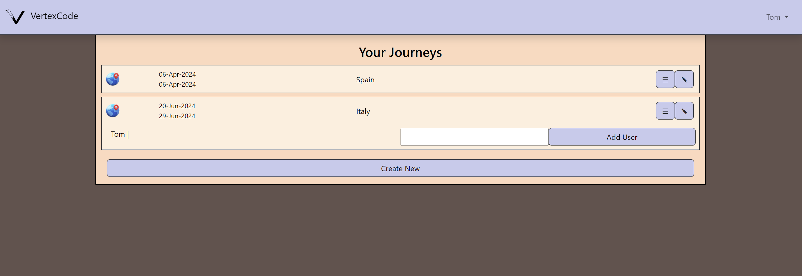

# Personal Portfolio
Django website where you can find more information about myself and  access my Django projects.
## Description

Currentyly, the website consists of:
* About Me page
* Journey Planner App
* Pool Shop Demo

### About Me
A simple database driven resume.

### Journey Planner
Django web app that allows you to plan a journy in colaboration with your friends.
#### Usage
* Create an account to be able to use the app

* Create your first Journey and add other users to plan it together

* Create and assign new points to the journey. Points of the journey can be assigned to the journey's calendar (top section) either via editing them  or by using  arrow buttons.

*  Each point can be located on the embedded Google maps. Simply search  for a location or address and save the result.

* You can also  view all the  points of the journey that are currently  assigned to the calendar by clicking the globe icon above it.

### Pool Shop Demo
Nothing special here. It was part of an assignment for the bootcamp I took part in. It is there to remind me that I should do somthing with it at some point. Feel free to ridicule the design :)"
